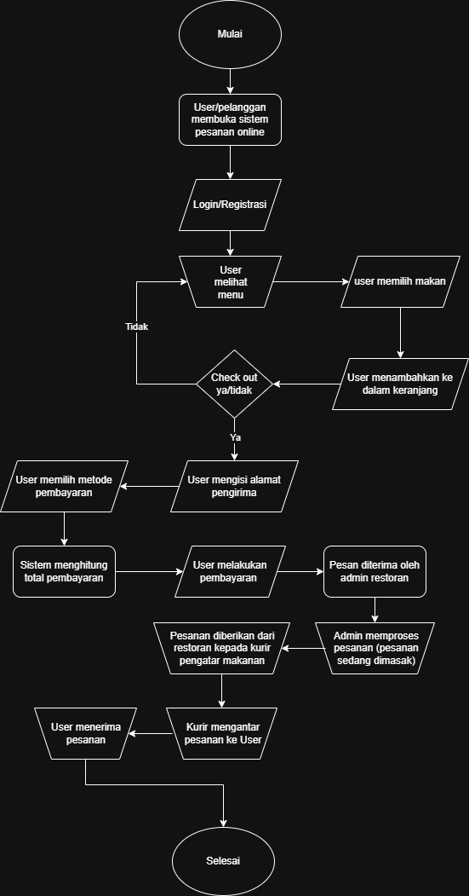

# Sistem_Pemesanan_Makanan_Online

## Progres 1 - Analisis Kebutuhan Sistem

## 1. Deskripsi Studi Kasus

Sistem Pemesanan Makanan Online adalah sistem yang digunakan untuk membantu pelanggan dalam memesan makanan secara online tanpa harus datang langsung ke tempat makan. Melalui sistem ini, pelanggan dapat melihat daftar menu, memilih makanan, memasukkan jumlah pesanan, melakukan checkout, memilih metode pembayaran, dan melihat status pesanan.

Sistem ini juga membantu pihak restoran atau admin dalam mengelola data menu, menerima pesanan, memperbarui status pesanan, serta melihat data transaksi. Dengan adanya sistem ini, proses pemesanan makanan menjadi lebih cepat, praktis, dan terorganisir.

## 2. Latar Belakang dan Tujuan Sistem

Perkembangan teknologi membuat banyak aktivitas dilakukan secara online, termasuk dalam pemesanan makanan. Pemesanan makanan secara manual sering menimbulkan beberapa masalah, seperti antrean panjang, kesalahan pencatatan pesanan, pelayanan yang lambat, dan sulitnya mengelola data transaksi.

Oleh karena itu, Sistem Pemesanan Makanan Online dibuat untuk mempermudah proses pemesanan antara pelanggan dan restoran. Sistem ini diharapkan dapat meningkatkan efisiensi pelayanan, mengurangi kesalahan pesanan, serta memudahkan pengelolaan data makanan dan transaksi.

Tujuan sistem ini adalah sebagai berikut:

1. Mempermudah pelanggan dalam memesan makanan secara online.
2. Menyediakan informasi menu makanan secara jelas.
3. Membantu admin atau restoran dalam mengelola menu dan pesanan.
4. Mengurangi kesalahan dalam pencatatan pesanan.
5. Mempercepat proses transaksi dan pelayanan.
6. Menyimpan data pesanan secara rapi dan terstruktur.

## 3. Identifikasi Aktor

Aktor yang terlibat dalam Sistem Pemesanan Makanan Online adalah sebagai berikut:

1. Pelanggan
   Pelanggan berperan sebagai pengguna yang dapat melihat menu, memilih makanan, melakukan checkout, melakukan pembayaran, dan melihat status pesanan.

2. Admin atau Restoran
   Admin atau restoran berperan dalam mengelola data menu, menerima pesanan, memperbarui status pesanan, dan melihat data transaksi.

3. Kurir
   Kurir berperan dalam mengantar pesanan kepada pelanggan dan memperbarui status pengiriman.

4. Sistem
   Sistem berperan dalam memproses data pesanan, menghitung total pembayaran, menyimpan data transaksi, dan menampilkan status pesanan.

## 4. Kebutuhan Fungsional

Kebutuhan fungsional dari Sistem Pemesanan Makanan Online adalah sebagai berikut:

1. Sistem dapat menampilkan daftar menu makanan dan minuman.
2. Sistem dapat menampilkan detail menu seperti nama, harga, deskripsi, dan gambar.
3. Pelanggan dapat melakukan registrasi akun.
4. Pelanggan dapat login ke dalam sistem.
5. Pelanggan dapat memilih menu makanan.
6. Pelanggan dapat menambahkan makanan ke keranjang.
7. Pelanggan dapat mengubah jumlah pesanan di keranjang.
8. Pelanggan dapat menghapus menu dari keranjang.
9. Sistem dapat menghitung total harga pesanan secara otomatis.
10. Pelanggan dapat melakukan checkout pesanan.
11. Pelanggan dapat memilih metode pembayaran.
12. Admin dapat menambah data menu.
13. Admin dapat mengubah data menu.
14. Admin dapat menghapus data menu.
15. Admin dapat melihat daftar pesanan yang masuk.
16. Admin dapat mengubah status pesanan, seperti diproses, dikirim, atau selesai.
17. Kurir dapat melihat pesanan yang harus diantar.
18. Kurir dapat memperbarui status pengiriman.
19. Pelanggan dapat melihat riwayat pesanan.
20. Sistem dapat menyimpan data transaksi pemesanan.

## 5. Kebutuhan Data

Data yang dibutuhkan dalam Sistem Pemesanan Makanan Online adalah sebagai berikut:

1. Data Pelanggan
   Berisi ID pelanggan, nama pelanggan, email, password, nomor handphone, dan alamat.

2. Data Admin
   Berisi ID admin, nama admin, username, dan password.

3. Data Menu
   Berisi ID menu, nama menu, kategori, harga, deskripsi, stok, dan gambar menu.

4. Data Pesanan
   Berisi ID pesanan, ID pelanggan, tanggal pesanan, total harga, dan status pesanan.

5. Data Detail Pesanan
   Berisi ID detail pesanan, ID pesanan, ID menu, jumlah pesanan, dan subtotal.

6. Data Pembayaran
   Berisi ID pembayaran, ID pesanan, metode pembayaran, dan status pembayaran.

7. Data Kurir
   Berisi ID kurir, nama kurir, dan nomor handphone.

8. Data Pengiriman
   Berisi ID pengiriman, ID pesanan, alamat tujuan, dan status pengiriman.

## 6. Diagram Proses

Berikut adalah flowchart proses Sistem Pemesanan Makanan Online:

Alur proses sistem secara umum adalah sebagai berikut:

1. Pelanggan membuka sistem.
2. Pelanggan melakukan login atau registrasi.
3. Pelanggan melihat daftar menu makanan.
4. Pelanggan memilih makanan.
5. Pelanggan menambahkan makanan ke keranjang.
6. Pelanggan melakukan checkout.
7. Pelanggan mengisi alamat pengiriman.
8. Pelanggan memilih metode pembayaran.
9. Sistem menghitung total pembayaran.
10. Pelanggan melakukan pembayaran.
11. Pesanan diterima oleh admin atau restoran.
12. Admin memproses pesanan.
13. Pesanan diberikan kepada kurir.
14. Kurir mengantar pesanan.
15. Pelanggan menerima pesanan.
16. Proses selesai.

## 7. Pembagian Tugas Kelompok 1

1. Rizki Ardiansyah (2501020097)
   Mengerjakan bagian deskripsi studi kasus, latar belakang, dan tujuan sistem.

2. Muhammad Rizqi Wijaya (2501020093)
   Mengerjakan bagian identifikasi aktor dan kebutuhan fungsional sistem.

3. Muhammad Rayhan Syaputra (2501020101)
   Mengerjakan bagian kebutuhan data dan diagram proses sistem.

4. Syah Levi Rayyan Ramadhan (2501020107)
   Mengerjakan bagian pembagian tugas anggota dan melengkapi link repository GitHub.

## 8. Link Repository GitHub

Link repository GitHub:

https://github.com/syahleviramadhan-ux/Sistem_Pemesanan_Makanan_Online/edit/main/README.md

## Progres 2 - Perancangan Basis Data

## 1. ERD Lengkap

ERD atau Entity Relationship Diagram digunakan untuk menggambarkan rancangan basis data pada Sistem Pemesanan Makanan Online. ERD ini menampilkan entitas, atribut, primary key, foreign key, dan relasi antar tabel.

Berikut adalah ERD dari Sistem Pemesanan Makanan Online:

Entitas yang digunakan dalam ERD ini terdiri dari pelanggan, admin, kategori menu, menu, pesanan, detail pesanan, pembayaran, kurir, dan pengiriman. Setiap entitas memiliki primary key sebagai identitas utama dan beberapa entitas memiliki foreign key sebagai penghubung antar tabel.

## 2. Penjelasan Entitas dan Relasi

### Penjelasan Entitas

| No | Entitas | Penjelasan |
|---|---|---|
| 1 | Pelanggan | Menyimpan data pelanggan yang melakukan pemesanan makanan secara online, seperti nama, email, password, nomor handphone, dan alamat. |
| 2 | Admin | Menyimpan data admin atau pihak restoran yang bertugas mengelola data menu makanan. |
| 3 | Kategori Menu | Menyimpan data kategori menu agar makanan dan minuman dapat dikelompokkan berdasarkan jenisnya. |
| 4 | Menu | Menyimpan data makanan dan minuman yang tersedia dalam sistem, seperti nama menu, deskripsi, harga, stok, gambar, kategori, dan admin pengelola. |
| 5 | Pesanan | Menyimpan data pesanan utama yang dibuat oleh pelanggan, seperti tanggal pesanan, total harga, dan status pesanan. |
| 6 | Detail Pesanan | Menyimpan rincian menu yang dipesan dalam satu pesanan, seperti jumlah dan subtotal. |
| 7 | Pembayaran | Menyimpan data pembayaran dari pesanan pelanggan, seperti metode pembayaran, status pembayaran, dan tanggal pembayaran. |
| 8 | Kurir | Menyimpan data kurir yang bertugas mengantar pesanan kepada pelanggan. |
| 9 | Pengiriman | Menyimpan data pengiriman pesanan, seperti alamat tujuan dan status pengiriman. |

### Penjelasan Relasi

| No | Relasi | Kardinalitas | Penjelasan |
|---|---|---|---|
| 1 | Pelanggan ke Pesanan | 1 : N | Satu pelanggan dapat membuat banyak pesanan, tetapi satu pesanan hanya dimiliki oleh satu pelanggan. |
| 2 | Pesanan ke Detail Pesanan | 1 : N | Satu pesanan dapat memiliki banyak detail pesanan, tetapi satu detail pesanan hanya berasal dari satu pesanan. |
| 3 | Menu ke Detail Pesanan | 1 : N | Satu menu dapat muncul di banyak detail pesanan, tetapi satu detail pesanan hanya memiliki satu menu. |
| 4 | Kategori Menu ke Menu | 1 : N | Satu kategori menu dapat memiliki banyak menu, tetapi satu menu hanya memiliki satu kategori. |
| 5 | Admin ke Menu | 1 : N | Satu admin dapat mengelola banyak menu, tetapi satu menu hanya dikelola oleh satu admin. |
| 6 | Pesanan ke Pembayaran | 1 : 1 | Satu pesanan memiliki satu pembayaran, dan satu pembayaran hanya digunakan untuk satu pesanan. |
| 7 | Pesanan ke Pengiriman | 1 : 1 | Satu pesanan memiliki satu data pengiriman, dan satu pengiriman hanya digunakan untuk satu pesanan. |
| 8 | Kurir ke Pengiriman | 1 : N | Satu kurir dapat mengantar banyak pengiriman, tetapi satu pengiriman hanya ditangani oleh satu kurir. |

## 3. Kamus Data

Kamus data digunakan untuk menjelaskan struktur data pada setiap tabel dalam database Sistem Pemesanan Makanan Online.

### Tabel Pelanggan

| Nama Field | Tipe Data | Key | Keterangan |
|---|---|---|---|
| id_pelanggan | INT | PK | ID unik pelanggan |
| nama_pelanggan | VARCHAR(100) | - | Nama pelanggan |
| email | VARCHAR(100) | - | Email pelanggan |
| password | VARCHAR(100) | - | Password akun pelanggan |
| no_hp | VARCHAR(20) | - | Nomor handphone pelanggan |
| alamat | TEXT | - | Alamat pelanggan |

### Tabel Admin

| Nama Field | Tipe Data | Key | Keterangan |
|---|---|---|---|
| id_admin | INT | PK | ID unik admin |
| nama_admin | VARCHAR(100) | - | Nama admin |
| username | VARCHAR(50) | - | Username admin |
| password | VARCHAR(100) | - | Password akun admin |

### Tabel Kategori Menu

| Nama Field | Tipe Data | Key | Keterangan |
|---|---|---|---|
| id_kategori | INT | PK | ID unik kategori menu |
| nama_kategori | VARCHAR(50) | - | Nama kategori menu |

### Tabel Menu

| Nama Field | Tipe Data | Key | Keterangan |
|---|---|---|---|
| id_menu | INT | PK | ID unik menu |
| id_kategori | INT | FK | ID kategori dari tabel kategori_menu |
| id_admin | INT | FK | ID admin dari tabel admin |
| nama_menu | VARCHAR(100) | - | Nama makanan atau minuman |
| deskripsi | TEXT | - | Deskripsi menu |
| harga | INT | - | Harga menu |
| stok | INT | - | Jumlah stok menu |
| gambar | VARCHAR(255) | - | Nama atau lokasi file gambar menu |

### Tabel Pesanan

| Nama Field | Tipe Data | Key | Keterangan |
|---|---|---|---|
| id_pesanan | INT | PK | ID unik pesanan |
| id_pelanggan | INT | FK | ID pelanggan dari tabel pelanggan |
| tanggal_pesanan | DATE | - | Tanggal pesanan dibuat |
| total_harga | INT | - | Total harga pesanan |
| status_pesanan | VARCHAR(50) | - | Status pesanan, seperti diproses, dikirim, atau selesai |

### Tabel Detail Pesanan

| Nama Field | Tipe Data | Key | Keterangan |
|---|---|---|---|
| id_detail | INT | PK | ID unik detail pesanan |
| id_pesanan | INT | FK | ID pesanan dari tabel pesanan |
| id_menu | INT | FK | ID menu dari tabel menu |
| jumlah | INT | - | Jumlah menu yang dipesan |
| subtotal | INT | - | Total harga per menu berdasarkan jumlah pesanan |

### Tabel Pembayaran

| Nama Field | Tipe Data | Key | Keterangan |
|---|---|---|---|
| id_pembayaran | INT | PK | ID unik pembayaran |
| id_pesanan | INT | FK | ID pesanan dari tabel pesanan |
| metode_pembayaran | VARCHAR(50) | - | Metode pembayaran yang digunakan |
| status_pembayaran | VARCHAR(50) | - | Status pembayaran, seperti menunggu, berhasil, atau gagal |
| tanggal_pembayaran | DATE | - | Tanggal pembayaran dilakukan |

### Tabel Kurir

| Nama Field | Tipe Data | Key | Keterangan |
|---|---|---|---|
| id_kurir | INT | PK | ID unik kurir |
| nama_kurir | VARCHAR(100) | - | Nama kurir |
| no_hp | VARCHAR(20) | - | Nomor handphone kurir |

### Tabel Pengiriman

| Nama Field | Tipe Data | Key | Keterangan |
|---|---|---|---|
| id_pengiriman | INT | PK | ID unik pengiriman |
| id_pesanan | INT | FK | ID pesanan dari tabel pesanan |
| id_kurir | INT | FK | ID kurir dari tabel kurir |
| alamat_tujuan | TEXT | - | Alamat tujuan pengiriman |
| status_pengiriman | VARCHAR(50) | - | Status pengiriman pesanan |

## 4. Normalisasi Database

Normalisasi database dilakukan untuk membuat struktur data menjadi lebih rapi, mengurangi pengulangan data, dan mencegah kesalahan dalam pengelolaan data. Pada Sistem Pemesanan Makanan Online, normalisasi dilakukan dari bentuk tidak normal sampai bentuk 3NF.

### Bentuk Tidak Normal / UNF

Pada bentuk tidak normal, data pesanan masih digabung dalam satu tabel besar. Menu yang dipesan juga masih ditulis dalam satu kolom sehingga data kurang rapi.

| id_pesanan | nama_pelanggan | alamat | menu_dipesan | jumlah | harga | total | metode_pembayaran | nama_kurir |
|---|---|---|---|---|---|---|---|---|
| 1 | Rizki | Tanjungpinang | Nasi Goreng, Es Teh | 2, 1 | 15000, 5000 | 35000 | Transfer | Raihan GO GREEN |

Permasalahan pada bentuk UNF adalah data menu, jumlah, dan harga masih digabung dalam satu kolom. Hal ini dapat menyulitkan proses pencarian, perhitungan, dan pengelolaan data.

### Normalisasi 1NF

Pada tahap 1NF, setiap data harus memiliki nilai tunggal. Oleh karena itu, menu yang sebelumnya digabung dalam satu kolom dipisahkan menjadi beberapa baris.

| id_pesanan | nama_pelanggan | alamat | menu_dipesan | jumlah | harga | subtotal | metode_pembayaran | nama_kurir |
|---|---|---|---|---|---|---|---|---|
| 1 | Rizki | Tanjungpinang | Nasi Goreng | 2 | 15000 | 30000 | Transfer | Raihan GO GREEN |
| 1 | Rizki | Tanjungpinang | Es Teh | 1 | 5000 | 5000 | Transfer | Raihan GO GREEN |

Pada tahap 1NF, data sudah memiliki nilai tunggal. Namun, masih terdapat pengulangan data seperti nama pelanggan, alamat, metode pembayaran, dan nama kurir.

### Normalisasi 2NF

Pada tahap 2NF, data yang tidak bergantung langsung pada detail pesanan dipisahkan ke dalam tabel masing-masing.

| Hasil 2NF | Keterangan |
|---|---|
| Tabel Pelanggan | Menyimpan data pelanggan agar tidak ditulis berulang dalam setiap pesanan. |
| Tabel Menu | Menyimpan data menu makanan dan minuman. |
| Tabel Pesanan | Menyimpan data utama pesanan pelanggan. |
| Tabel Detail Pesanan | Menyimpan rincian menu yang dipesan dalam satu pesanan. |

Pada tahap ini, data menjadi lebih rapi karena informasi pelanggan dan menu tidak lagi ditulis berulang dalam setiap transaksi.

### Normalisasi 3NF

Pada tahap 3NF, data yang masih memiliki ketergantungan tidak langsung dipisahkan lagi ke dalam tabel baru.

| Hasil 3NF | Keterangan |
|---|---|
| pelanggan | Menyimpan data pelanggan. |
| admin | Menyimpan data admin atau pengelola restoran. |
| kategori_menu | Menyimpan data kategori menu. |
| menu | Menyimpan data makanan dan minuman. |
| pesanan | Menyimpan data pesanan utama. |
| detail_pesanan | Menyimpan rincian pesanan. |
| pembayaran | Menyimpan data pembayaran. |
| kurir | Menyimpan data kurir. |
| pengiriman | Menyimpan data pengiriman. |

Dengan bentuk 3NF, database menjadi lebih terstruktur, mengurangi pengulangan data, dan mempermudah proses penyimpanan serta pengelolaan data.

## 5. Revisi Analisis Kebutuhan

Pada Progres 2, terdapat beberapa penyesuaian dari analisis kebutuhan sistem pada Progres 1. Revisi dilakukan agar kebutuhan sistem lebih sesuai dengan rancangan basis data.

| No | Revisi | Keterangan |
|---|---|---|
| 1 | Menambahkan data kategori menu | Agar menu dapat dikelompokkan berdasarkan jenis tertentu, seperti makanan dan minuman. |
| 2 | Menambahkan data detail pesanan | Agar satu pesanan dapat memiliki lebih dari satu menu. |
| 3 | Menambahkan data pembayaran | Agar metode pembayaran dan status pembayaran dapat disimpan dengan jelas. |
| 4 | Menambahkan data pengiriman | Agar alamat tujuan dan status pengiriman dapat tercatat. |
| 5 | Menambahkan data kurir | Agar proses pengantaran pesanan dapat dikelola dengan baik. |
| 6 | Menyesuaikan kebutuhan data | Agar kebutuhan data sesuai dengan entitas yang terdapat pada ERD. |

Dengan adanya revisi ini, rancangan Sistem Pemesanan Makanan Online menjadi lebih lengkap dan sesuai dengan kebutuhan database.

Dengan adanya revisi ini, rancangan Sistem Pemesanan Makanan Online menjadi lebih lengkap dan sesuai dengan kebutuhan database.
